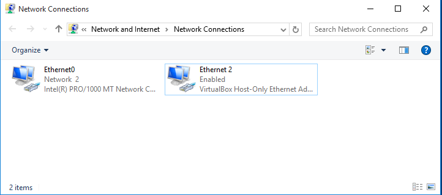
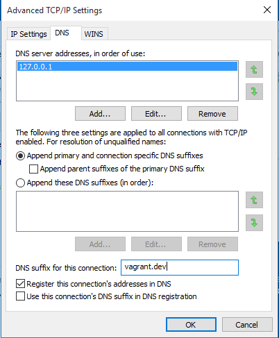

# Landrush: DNS for Vagrant 

Landrush is a simple cross-platform DNS for Vagrant VMs that is visible on both,
the guest and the host.

It spins up a small DNS server and redirects DNS traffic from your
VMs to use it, automatically registering/unregistering IP addresses of guests
as they come up and go down.

**Note**: Windows support is currently considered experimental. If you having
problems using Landrush on Windows please let us know.

<!-- MarkdownTOC -->

- [Installation](#installation)
- [Usage](#usage)
    - [Getting started](#getting-started)
    - [Dynamic entries](#dynamic-entries)
    - [Static entries](#static-entries)
    - [Wildcard Subdomains](#wildcard-subdomains)
    - [Unmatched Queries](#unmatched-queries)
    - [Visibility on the Guest](#visibility-on-the-guest)
    - [Visibility on the Host](#visibility-on-the-host)
        - [OS X](#os-x)
        - [Linux](#linux)
        - [Windows](#windows)
        - [Other Devices \(phone\)](#other-devices-phone)
    - [Additional CLI commands](#additional-cli-commands)
- [Miscellaneous Tricks and Tips](#miscellaneous-tricks-and-tips)
    - [How to avoid providing sudo password on OS X](#how-to-avoid-providing-sudo-password-on-os-x)
    - [Guest is unable to access the Internet](#guest-is-unable-to-access-the-internet)
- [Development](#development)
- [Help Out!](#help-out)

<!-- /MarkdownTOC -->

## Installation

Install under Vagrant (1.1 or later):

    $ vagrant plugin install landrush

## Usage

### Getting started

1. Enable the plugin in your `Vagrantfile`:

        config.landrush.enabled = true

1. Bring up a machine.

        $ vagrant up

1. You are able to get your VM's hostname resolved on your host:

    $ dig -p 10053 @localhost myhost.vagrant.test

1. If you shut down your guest, the entries associated with it will be removed.

Landrush retrieves your VM's hostname from either the vagrant config
or it uses the system's actual hostname by running the `hostname` command.
A default of "guest-vm" is assumed if hostname is otherwise not available.

A Landrush example configuration could look like this:

    Vagrant.configure("2") do |config|
      config.vm.box = "hashicorp/precise64"

      config.landrush.enabled = true

      config.vm.hostname = "myhost.vagrant.test"

      config.landrush.host 'static1.example.com', '1.2.3.4'
      config.landrush.host 'static2.example.com', '2.3.4.5'
    end

### Dynamic entries

Every time a VM is started, its IP address is automatically detected and a DNS record is created
that maps the hostname to its IP. The detection works by listing all configured interfaces of the
guest using [landrush-ip](https://rubygems.org/gems/landrush-ip/versions/0.2.5), picking the last
valid IP found, while ignoring any excluded interfaces.

Excluded interfaces are an array of regular expressions; the value shown here is the default used
when no explicit value for `config.landrush.host_interface_excludes` is specified in your
`Vagrantfile`:

    config.landrush.host_interface_excludes = [/lo[0-9]*/, /docker[0-9]+/, /tun[0-9]+/]

If Landrush fails to detect the correct IP address (or none at all), you can extend this exclusion
range to exclude more interfaces.

If you need or want to select an interface explicitly and you know its name, you can also tell
Landrush to grab that interface's IP address explicitly:

    config.landrush.host_interface = 'eth0'

Do note that, if you specify an interface explicitly, it will have priority over
`config.landrush.host_interface_excludes`. In other words, if `config.landrush.host_interface_excludes`
is set to `[/eth[0-9]*/]`, but `config.landrush.host_interface` is set to `eth0` and `eth0` exists
as an interface, the IP address of `eth0` is returned. The interface setting takes precedence over
the exclude setting. If the interface does not exist, the regular heuristics will apply and Landrush
will pick the last non-excluded IP found.

If all else fails, you can override it entirely:

    config.landrush.host_ip_address = '1.2.3.4'

This setting will override both the exclude and interface settings completely.

If you are using a multi-machine `Vagrantfile`, configure this inside each of your `config.vm.define`
sections.

### Static entries

You can add static host entries to the DNS server in your `Vagrantfile` like so:

    config.landrush.host 'myhost.example.com', '1.2.3.4'

This is great for overriding production services for nodes you might be testing locally. For example,
perhaps you might want to override the hostname of your puppetmaster to point to a local vagrant box
instead.

### Wildcard Subdomains

For your convenience, any subdomain of a DNS entry known to landrush will resolve to the same IP
address as the entry. For example: given `myhost.vagrant.test -> 1.2.3.4`, both
`foo.myhost.vagrant.test` and `bar.myhost.vagrant.test` will also resolve to `1.2.3.4`.

If you would like to configure your guests to be accessible from the host as subdomains of something
other than the default `vagrant.test`, you can use the `config.landrush.tld` option in your
Vagrantfile like so:

    config.landrush.tld = 'vm'

Note that from the __host__, you will only be able to access subdomains of your configured TLD by
default- so wildcard subdomains only apply to that space. For the __guest__, wildcard subdomains
work for anything.

### Unmatched Queries

Any DNS queries that do not match any of Landrush'es configuration data, will be passed
through to an upstream DNS server. Per default Landrush uses Google's DNS server with the
IP _8.8.8.8_.

If you would like to configure your own upstream servers, add upstream entries to your
`Vagrantfile` like so:

    config.landrush.upstream '10.1.1.10'
    # Set the port to 1001
    config.landrush.upstream '10.1.2.10', 1001
    # If your upstream is TCP only for some strange reason
    config.landrush.upstream '10.1.3.10', 1001, :tcp

### Visibility on the Guest

Linux guests should automatically have their DNS traffic redirected via `iptables` rules to the
Landrush DNS server. File an issue if this does not work for you.

To disable this functionality:

    config.landrush.guest_redirect_dns = false

You may want to do this if you are already proxying all your DNS requests through your host
(e.g. using VirtualBox's natdnshostresolver1 option) and you
have DNS servers that you can easily set as upstreams in the daemon (e.g. DNS requests that go
through the host's VPN connection).

### Visibility on the Host

Visibility on the host means that the hostname of the VMs can be resolved on the host's DNS system.
Landrush will attempt an automatic configuration of the host, but depending on the OS, manual
configuration might be required as well.

To disable this functionality:

    config.landrush.host_redirect_dns = false

#### OS X

If you're on an OS X host, we use a nice trick to unobtrusively add a secondary DNS server only for
specific domains. Landrush adds automatically during startup a file into `/etc/resolver`
that points lookups for hostnames ending in your `config.landrush.tld` domain to its DNS server.
(Check out `man 5 resolver` on your Mac OS X host for more information on this file's syntax.)

#### Linux

Landrush tries to achieve the same behavior on Linux hosts using
`dnsmasq`. For some Linux distributions this happens automatically (you might
have to provide your _sudo_ password). If Landrush does not know how to install and
start `dnsmasq` on your favorite Linux distribution, you can adjust the following
example from Ubuntu:

    sudo apt-get install -y resolvconf dnsmasq
    sudo sh -c 'echo "server=/vagrant.test/127.0.0.1#10053" > /etc/dnsmasq.d/vagrant-landrush'
    sudo service dnsmasq restart

If you use a TLD other than the default `vagrant.test`, replace the TLD in the above instructions
accordingly. Please be aware that anything ending in '.local' as TLD will not work because the
`avahi` daemon reserves this TLD for its own uses.

#### Windows

On Windows a secondary DNS server can be configured via the properties of the
network adapter used by the VM. Landrush will attempt to configure the adapter automatically
during startup. If this fails, please follow the manual setup instructions below.

It is recommended to use an elevated command prompt (command prompt with full administrator
permissions), since admin privileges are needed to make the required changes. Landrush will
try to elevate your prompt automatically, but this requires to spawn additional processes which in
turn loose some potentially important log messages.

In the following section manual network configuration is described using Windows 10 and
VirtualBox.

When running VirtualBox on Windows in combination with Landrush the Network
Connections (`Control Panel\Network and Internet\Network Connections`) looks
somewhat like this after a successful `vagrant up`:

There will be at least one VirtualBox network adapter. There might be multiple
depending on your configuration (number of networks configured) and how many VMs
you have running, but you just need to modify one.

In a first step you need to identify the VirtualBox network adapter used for the
private network of your VM. Landrush requires a private network adapter to work
and will create one in case you are not explicitly configuring one in your
`Vagrantfile`.

To quickly view the settings of each network adapter you can run the following
command in a shell:

    netsh interface ip show config

The output should look something like that:

    Configuration for interface "Ethernet0"
        DHCP enabled:                         Yes
        IP Address:                           172.16.74.143
        Subnet Prefix:                        172.16.74.0/24 (mask 255.255.255.0)
        Default Gateway:                      172.16.74.2
        Gateway Metric:                       0
        InterfaceMetric:                      10
        DNS servers configured through DHCP:  172.16.74.2
        Register with which suffix:           Primary only
        WINS servers configured through DHCP: 172.16.74.2

    Configuration for interface "VirtualBox Host-Only Network"
        DHCP enabled:                         No
        IP Address:                           10.1.2.1
        Subnet Prefix:                        10.1.2.0/24 (mask 255.255.255.0)
        InterfaceMetric:                      10
        Statically Configured DNS Servers:    None
        Register with which suffix:           Primary only
        Statically Configured WINS Servers:   None

In our case we are interested in the `VirtualBox Host-Only Network` which
has in this example the private network IP 10.1.2.1. If you don't have a static
private network IP configured and you cannot determine the right adapter via
the `netsh` output, ssh into the VM (`vagrant ssh`) and run `ifconfig` to view
the network configuration of the VM.

Once you identified the right network adapter run the following as Administrator
(using the network adapter name of the adapter with the determined private
network IP):

     netsh interface ipv4 add dnsserver "VirtualBox Host-Only Network" address=127.0.0.1 index=1

This should be enough for Windows 10. On other Windows versions, you might have to
also add your TLD to the DNS suffix list on the DNS Advanced TCP/IP Settings tab:

#### Other Devices (phone)

You might want to resolve Landrush's DNS-entries on *additional* computing devices, like a mobile phone.

Please refer to [/doc/proxy-mobile](/doc/proxy-mobile) for instructions.

### Additional CLI commands

Check out `vagrant landrush` for additional commands to monitor the DNS server daemon.

## Miscellaneous Tricks and Tips

### How to avoid providing sudo password on OS X

When using Landrush on OS X, Landrush will try to create a file in `/etc/resolver` to make the guest
VM visible via DNS on the host (see [OS X](#os-x) in the [visibility on host](#visibility-on-the-host)
section). To create this file sudo permissions are needed and Landrush will ask you for your sudo
password. This can be avoided by adding the following entries to the bottom of the sudoer
configuration. Make sure to edit your `/etc/sudoers` configuration via `sudo visudo`:

    # Begin Landrush config
    Cmnd_Alias VAGRANT_LANDRUSH_HOST_MKDIR = /bin/mkdir /etc/resolver/*
    Cmnd_Alias VAGRANT_LANDRUSH_HOST_CP = /bin/cp /*/vagrant_landrush_host_config* /etc/resolver/*
    Cmnd_Alias VAGRANT_LANDRUSH_HOST_CHMOD = /bin/chmod 644 /etc/resolver/*
    %admin ALL=(ALL) NOPASSWD: VAGRANT_LANDRUSH_HOST_MKDIR, VAGRANT_LANDRUSH_HOST_CP, VAGRANT_LANDRUSH_HOST_CHMOD
    # End Landrush config

### Guest is unable to access the Internet

In some network configuration the access to outside DNS servers is restricted
(firewalls, VPN, etc). Since unmatched DNS queries are per default passed through to
Google's DNS servers, this can lead to the fact that the guest cannot access anything
in the outside world.
If you are having problem with the guest's DNS, verify that you can access Google's
DNS server under _8.8.8.8_. If it does not work, you will need to set a custom
upstream DNS server. Check your network configuration on the host or ask your network
administrator about the right DNS server address to use. You can set the custom
DNS server via the _config.landrush.upstream_ option (see section about
[unmatched queries](#unmatched-queries)).

## Development

The following should get you started to develop on the Landrush code base. As a prerequisite you
will need a Ruby 2.0 environment. We recommend to use [RVM](https://rvm.io/) to create an isolated
development environment. On Windows the [RubyInstaller for Windows](http://rubyinstaller.org/) is
probably the easiest way to get started. In this case you will need the
[DevKit](http://rubyinstaller.org/add-ons/devkit/) as well.

Once you have a working Ruby environment it is time to
[fork](https://help.github.com/articles/fork-a-repo/) the repository
(refer to the [CONTRIBUTING.md](CONTRIBUTING.md) guide for more info].

The following are the most important commands you will need for development:

* Install [Bundler](http://bundler.io/):

        $ gem install bundler

* Install dependencies:

        $ bundle install

* Get a list of all available build tasks:

        $ bundle exec rake -T

* Run the test suite:

        $ bundle exec rake test

* Run a single test file:

        $ bundle exec rake test TEST=<path to test file>

* Run cucumber/aruba acceptance tests:

        $ bundle exec rake features

  Note, that the acceptance tests currently only work out of the box on OS X.
  On Linux one has to manually configure the host visibility for the TLD
  _landrush-acceptance-test_. See for [Linux](#linux). On Windows the acceptance
  tests won't work due to a current bug in [Aruba](https://github.com/cucumber/aruba/issues/387).

* Run a single cucumber/aruba acceptance tests:

        $ bundle exec rake features FEATURE=features/<feature-filename>.feature

* Build the Landrush gem:

        $ bundle exec rake install

* Clean all generated files:

        $ bundle exec rake clean clobber

* Deploy to RubyGems:

        $ bundle exec rake release

* Run the vagrant binary with the Landrush plugin loaded from your local source code:

        bundle exec vagrant landrush <command>

## Help Out!

This project could use your feedback and help! Please don't hesitate to open issues or submit pull
requests. NO HESITATION IS ALLOWED. NONE WHATSOEVER. See [CONTRIBUTING.md](CONTRIBUTING.md) for
more details.

The Maintainers try to meet periodically.  [Notes](NOTES.md) are available.
